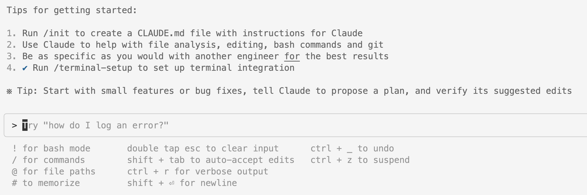

# Claude Code Guidelines




## 1. Claude Rules

1. First think through the problem, read the codebase for relevant files, and write a plan to tasks/todo.md.

2. The plan should have a list of todo items that you can check off as you complete them

3. Before you begin working, check in with me and I will verify the plan.

4. Then, begin working on the todo items, marking them as complete as you go.

5. Please every step of the way just give me a high level explanation of what changes you made

6. Make every task and code change you do as simple as possible. We want to avoid making any massive or complex changes. Every change should impact as little code as possible. Everything is about simplicity.

7. Finally, add a review section to the [todo.md](http://todo.md/) file with a summary of the changes you made and any other relevant information.

8. All resulting products (code, documentation, comments, variable names, etc.) must be written in English.


---


## 2. Use Plan Mode

```bash
open claude
# Press Shift + Tab (2x) to enter Plan Mode
```

### Best Practices:
1. **Over use Plan Mode** - Better to plan too much than too little
2. **Use the right model for each phase:**
   - **Opus** → Planning and complex reasoning
     ```
     /model opus
     ```
   - **Sonnet** → Code execution and implementation
     ```
     /model sonnet
     ```


---

## 3. Set Claude Code to "live dangerously" by bypassing unnecessary permissions

### Why use this flag:
- **Faster execution** - Skip permission prompts for common operations
- **Better workflow** - Reduce interruptions during development
- **Trust your setup** - When working in safe, controlled environments

```bash
# Add to your shell profile (~/.bashrc, ~/.zshrc, etc.)
alias claude='claude --dangerously-skip-permissions'
```

**⚠️ Warning**: Only use in trusted development environments!

---

## 4. Saving Savepoints

### Strategy:
- Use **Git commits** for regular savepoints
- Create **branches** for experimental features
- **Push frequently** to avoid losing work

```bash
git add .
git commit -m "Save progress: feature description"
git push
```

## 5. When to use images

### Effective use cases:
1. **UI Inspiration** - Show mockups or design references
2. **Bug fixing** - Screenshots of error messages or UI issues

---

## 6. Use `/clear`

### Benefits:
1. **Reduce hallucinations** - Fresh context prevents confusion
2. **Save money** - Smaller context windows cost less

---

## 7. Security Checks

### Workflow:
1. **Use plan mode** - Plan your security approach
2. **Execute** - Implement the planned changes
3. **Security review** - Run comprehensive security checks

### Security Review Prompt:
```
Please check through all the code you just wrote and make sure it follows security best practices. Make sure there are no sensitive information in the frontend and there are no vulnerabilities that can be exploited.
```

---

## 8. Learn from Claude

### Learning Workflow:
1. **Use plan mode** - Plan your implementation approach
2. **Execute** - Build the feature or fix
3. **Security checks** - Ensure code safety
4. **Learn & understand** - Deep dive into what was built

### Learning Prompt:
```
Please explain the functionality and code you just built out in detail. Walk me through what you changed and how it works. Act like you're a senior engineer teaching me code.
```

---

## 9. Be productive while Claude cooks

### Productive Use of Wait Time:

Instead of doom scrolling during AI processing time, use these strategies:

#### Prompt for Productive Conversations:
```
When I am coding with AI there are long breaks between me giving commands to the AI. Typically I spend that time doom scrolling which distracts me and puts me in a bad mental state. I'd like to use that time now to chat with you and generate new ideas, and also reflect on my other ideas and businesses and content. I'm not sure how I'd like to use this chat or what role I'd like you to play, but I think it could be much more useful than me doom scrolling. What do you think? What could be the best way for us to use this chat?
```

#### Alternative Activities:
- **Code review** - Review what Claude just implemented
- **Architecture planning** - Think about next features
- **Documentation** - Update README or comments
- **Testing strategy** - Plan test cases
- **Refactoring opportunities** - Identify areas for improvement


